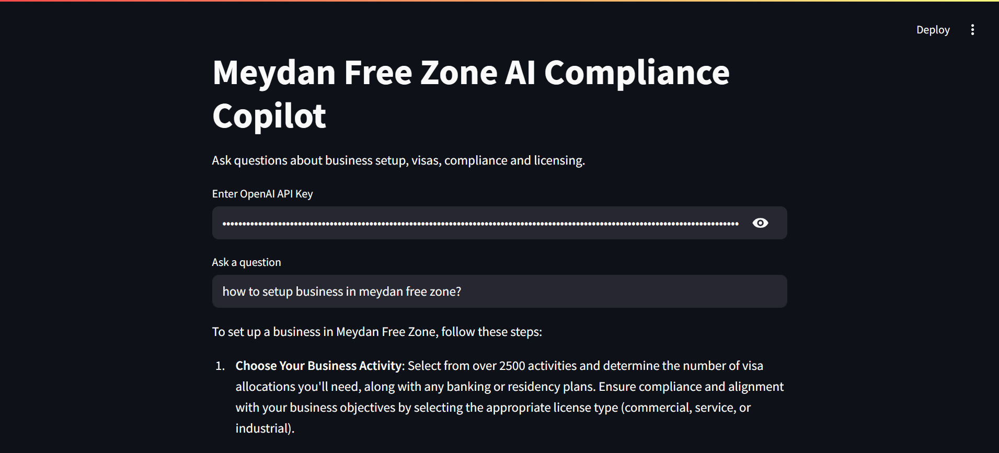
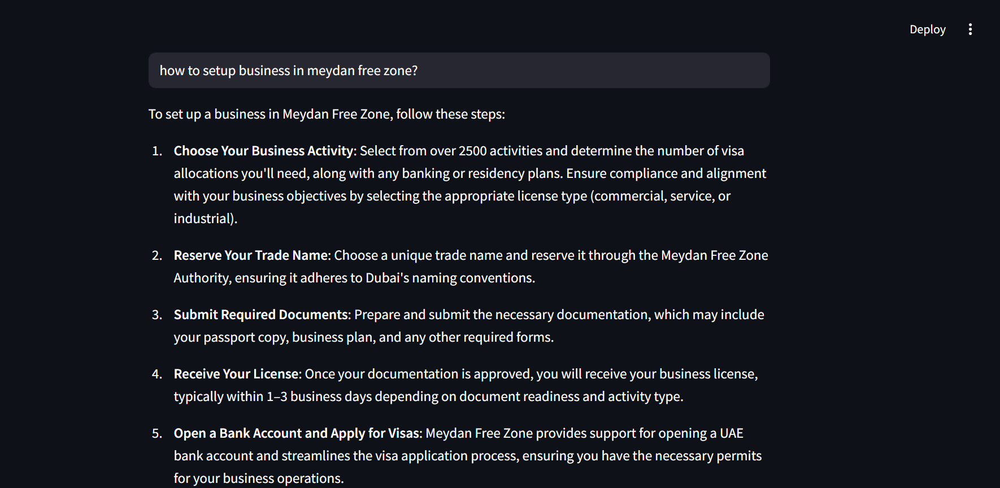
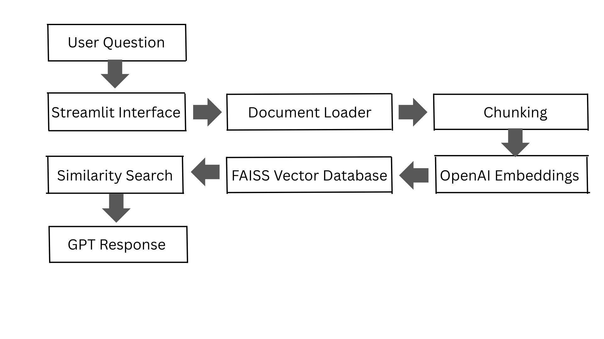

# AI Compliance Copilot for Meydan Free Zone

An AI-powered assistant that helps entrepreneurs navigate company setup, licensing, visa procedures, and regulatory workflows in Meydan Free Zone, Dubai.

This project demonstrates how Retrieval-Augmented Generation (RAG) can be used to build a domain-specific AI assistant for regulatory guidance.

The system retrieves information from curated free-zone documentation and generates contextual answers using a large language model.

---

# Demo

## Application Interface



## Example Response



---

# Problem

Entrepreneurs setting up companies in UAE free zones often face several challenges:

• Understanding licensing requirements
• Navigating visa procedures and quotas
• Managing compliance timelines
• Preparing documents correctly
• Finding accurate regulatory information

Even though free zones like Meydan offer digital company formation, founders may still face delays due to incomplete documentation or misunderstanding compliance workflows.

---

# Solution

The Meydan Free Zone AI Compliance Copilot provides an intelligent assistant that helps founders understand the regulatory process.

Instead of relying on generic chatbot responses, the system retrieves relevant information from a curated knowledge base of UAE free-zone documentation.

The AI then generates contextual answers based on this information.

This allows entrepreneurs to receive guidance on topics such as:

• Company setup procedures
• Visa allocation and sponsorship
• Licensing requirements
• Compliance obligations
• Business formation timelines

---

# System Architecture

The system follows a Retrieval-Augmented Generation (RAG) architecture.

Pipeline:

1. Documents related to Meydan Free Zone setup and compliance are collected.
2. The documents are chunked into smaller text segments.
3. Each chunk is converted into vector embeddings.
4. A FAISS vector index is built for semantic search.
5. User queries are embedded and compared against the vector store.
6. The most relevant chunks are retrieved as context.
7. The LLM generates a grounded answer based on retrieved context.



Workflow:

1. The user submits a query through the Streamlit interface.
2. The system loads regulatory documents from the knowledge base
3. Documents are split into smaller chunks for efficient retrieval.
4. Each chunk is converted into vector embeddings using OpenAI embedding models.
5. FAISS vector search retrieves the most relevant information
6. The retrieved context is sent to a language model
7. The AI generates a contextual answer for the user

This ensures responses are grounded in domain-specific knowledge rather than generic LLM outputs.

---

# Tech Stack

Python
Streamlit
OpenAI API
FAISS Vector Database
NumPy

AI Techniques Used:

Retrieval-Augmented Generation (RAG)
Vector Embeddings
Semantic Search

---

# Project Structure

```
meydan-ai-compliance-copilot
│
├── app
│   └── app.py
│
├── docs
│   ├── faq.txt
│   ├── license_renewal.txt
│   ├── setup_process.txt
│   └── visa_challenges.txt
│
├── screenshots
│   ├── ui.png
│   └── example-answer.png
│
├── architecture.png
├── requirements.txt
└── README.md
```

---

# Installation

Clone the repository:

```
git clone https://github.com/yourusername/meydan-ai-compliance-copilot.git
```

Navigate into the project directory:

```
cd meydan-ai-compliance-copilot
```

Install the required dependencies:

```
pip install -r requirements.txt
```

---

# Running the Application

Start the Streamlit application:

```
python -m streamlit run app/app.py
```

The application will open in your browser at:

```
http://localhost:8501
```

Enter your OpenAI API key and start asking questions.

---

# Example Questions

Try asking the assistant questions like:

• How do I open a consulting company in Meydan Free Zone?
• What visa challenges do startups face in Dubai free zones?
• How can I sponsor my spouse after setting up a company in Meydan Free Zone?
• What documents are required for company setup in Meydan Free Zone?

---

# Future Improvements

Possible extensions of this project include:

• Integration with official free-zone APIs
• Multilingual support (Arabic + English)
• Guided compliance workflows for founders
• Support for multiple UAE free zones
• Automatic document updates from regulatory sources

---

# Use Case

This system could serve as a digital compliance assistant for:

• Entrepreneurs setting up companies in Dubai
• Free zone authorities providing automated guidance
• Business consultants supporting international founders

---

# Author

Ashish Seru
MSc Artificial Intelligence
De Montfort University Dubai

---

# License

This project is intended for educational and demonstration purposes.
